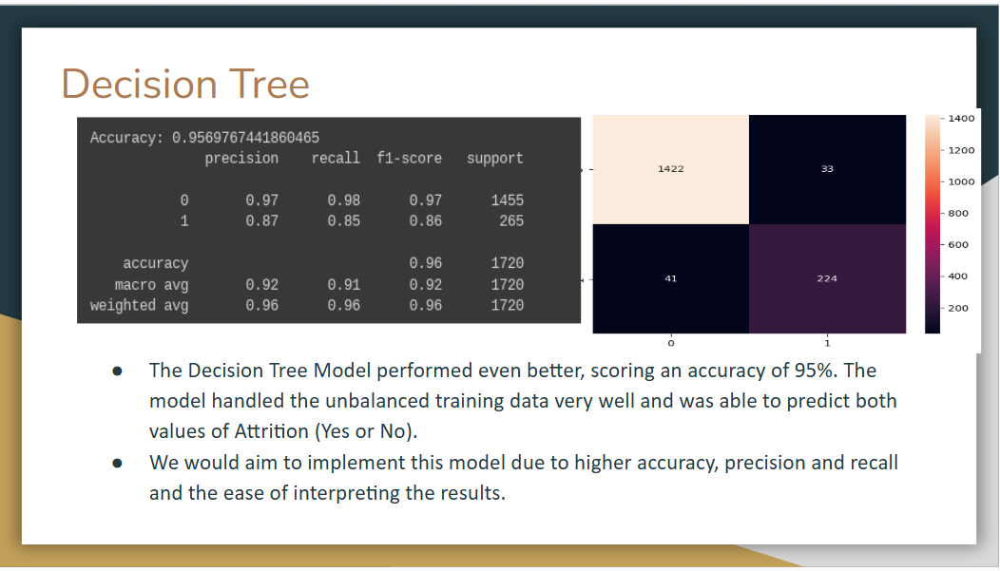
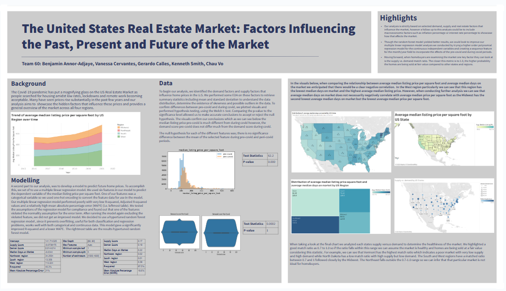

# Kenny-s-Portfolio
Data Portfolio

<!--Section 1: Introduce your self-->
## ABOUT ME

Hello! I'm Kenny Smith 🤓, a Senior Data Analyst currently working for Bank of America within the Enterprise Credit Data Strategy & Governance organization. I am passionate about using advanced analytics to help companies drive organic growth through improved efficiency and cost savings through powerful reporting to uncover insights, automating mundane and repeat tasks through ETL tools and utilizing artifical intelligence frameworks to deploy prescriptive and predictive models. 

<!--Mention your top/relevant skills here - core and soft skills-->
## WHAT I DO

*With 5+ years of experience in Data Analytics and Data Science, I have gained the following skills.*
## PROGRAMMING
**- ✅ Python.**
Packages used include Pandas, Numpy, MatPlotLib, SciKit-Learn, TensorFlow, Seaborn, Plotly 
**- ✅ SQL.**
IDE's used includes Toad for SQL Server, Oracle SQL Developer, PrestoSQL
**- ✅ R.**
Packages used include ggplot2, caret, e1071

## TOOLS
**- ✅ Alteryx.**
Created over 100 workflows for setting up data pipelines, automating report creation, building RESTful APIs, and using SMTP to schedule automated emails for important updates.  
**- ✅ Tableau.**
Leads dynamic reporting, using advanced concepts including calculated fields, parameters, actions and more. 

<!--Section 2: List 3-4 key projects-->
## MY PORTFOLIO 

*A glimpse of some of the projects I've been working on.*

**Predictive Modeling and Hypothesis Testing to help an HR Department Reduce/Plan for Attrition.**

Summary: During this project, we were portrayed as consultants to a company looking to understand and plan for attrition within their company. We used statistcal modeling to find the various important attributes and then used them to train a Decision Tree and Logistic Regression model to predict which employees would leave versus which would stay. 

[Learn More](https://drive.google.com/drive/folders/1ilPszHCMcltSQQeigEya-av1lxLnHdla?usp=drive_link)

**Predictive Modeling and Hypothesis Testing Surrounding the Future of the United States Real Estate Market.**

Summary: Launched this project after the onset of the Covid-19 pandemic and response of massive increases in home values across the United States in the years after. Main objectives were to conduct exploratory data analysis to identify key factors causing the increase in home prices and also to build a linear regression model that could predict future home prices. Feel free to dive into the coding workbook and datafolio for this project at the link below!

[Read More](https://drive.google.com/drive/folders/1Ki2uTiqJPgr1ksEgQ4fXv2TIjd1eccV6?usp=drive_link)

## CONTACT DETAILS

*Let’s connect and see how we can make a difference together!*
<table>
  <tbody>
    <tr>
      <td>📧</td>
      <td><a href="mailto:kennethasmith96@gmail.com">kennethasmith96@gmail.com</a></td>
    </tr>
    <tr>
      <td>📞</td>
      <td>770-238-8869</td>
    </tr>
    <tr>
      <td>📍</td>
      <td>Atlanta, GA</td>
    </tr>
    <tr>
      <td>⬇️</td>
      <td><a href="https://github.com/KSmithJr/Kenny-s-Portfolio/blob/af7decba47fcba7f20eda0fe1a60ef8e0f6f2a87/Kenneth%20Smith%20Resume%202025-2026.pdf">Download my CV</a></td>
    </tr>
    <tr>
      <td>🌐</td>
      <td><a href="https://www.linkedin.com/in/kenneth-a-smith/">The things I do daily on LinkedIn</a></td>
    </tr>
    <tr>
     
      
    </tr>
  </tbody>
</table>
