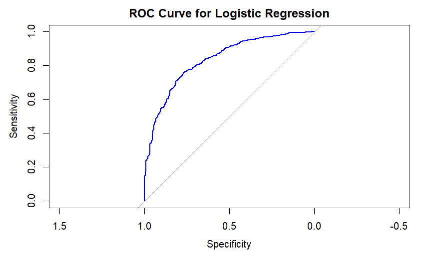

# Kenny-s-Portfolio
Data Portfolio

<!--Section 1: Introduce your self-->
## ABOUT ME

Hello! I'm Kenny Smith 🤓, a Analytics & Insights Manager currently working at Inteors.AI, an AI-powered SaaS platform monitoring over 230 million entities and 11 billion supplier-buyer relationships designed for real-time supply chain risk management. I thrive in operating at the intersection of data science, data engineering and data analytics, leading teams and initiatives to drive organic growth through powerful reporting and insights, predictive and prescriptive modeling to forecast and support decision making, custom AI Agent and GPT creation, and utilizing an expansive analytics toolkit to automate repeatable tasks. 

<!--Mention your top/relevant skills here - core and soft skills-->
## WHAT I DO

*With 7+ years of experience in Analytics Engineering, I have gained the following skills.*
## PROGRAMMING
**- ✅ Python.**
Packages used include Pandas, Numpy, MatPlotLib, SciKit-Learn, TensorFlow, Seaborn, Plotly 
**- ✅ SQL.**
Experience extracting, querying, and transforming data using Snowflake, Databricks (Spark SQL), Toad for SQL Server, Oracle SQL Developer, PrestoSQL, and Apache Impala (Hadoop) 
**- ✅ R.**
Packages used include ggplot2, caret, e1071

## TOOLS
**- ✅ Alteryx.**
Created over 100 workflows for setting up data pipelines, automating report creation, building RESTful APIs, and using SMTP to schedule automated emails for important updates.  
**- ✅ Tableau.**
Leads dynamic reporting, using advanced concepts including calculated fields, parameters, actions and more. 

**- ✅ Palantir Foundry & AIP.**
Develops ontologies, builds data pipelines, and leverages AI/ML workflows to generate actionable insights from complex, multi-source datasets.

**- ✅ Snowflake & Databricks (Spark SQL).**
Extracts, queries, and transforms multi-terabyte datasets to deliver scalable insights and support predictive analytics initiatives. Builds agents utilizing Cortex AI and Snowfalke Intelligence to empower users to uncover insights using natural language. 

**- ✅ Google Cloud Platform.**
Builds and deploys machine learning models, manages cloud-based data pipelines, and integrates analytics workflows with enterprise cloud infrastructure.

<!--Section 2: List 3-4 key projects-->
## MY PORTFOLIO 

*A glimpse of some of the projects I've been working on.*

**Automated Credit Risk Engine Using Palantir Foundry & AIP.**
 

Summary: Selected as one of the thirty fellows admitted into the inagual Palantir American Tech Fellowship where we gained hands-on skills as Forward Deployed Engineers, learning and implementing solutions with Foundry & AIP. As part of my capstone project, I leveraged my background in banking to create an credit risk monitoring engine with built in AI features to fully automate client review and monitoring while providing augmented intelligence to Credit Risk Managers and Analysts with AI Agents that help with decision making. 

Link to demo: https://drive.google.com/file/d/1YakA_eXqDuQUKgS7Lax24i_V5-KO3G3S/view?usp=sharing 

**Predictive Modeling and Hypothesis Testing to help an HR Department Reduce/Plan for Attrition.**

Summary: During this project, we were portrayed as consultants to a company looking to understand and plan for attrition within their company. We used statistcal modeling to find the various important attributes and then used them to train a Decision Tree and Logistic Regression model to predict which employees would leave versus which would stay. 

[Learn More](https://drive.google.com/drive/folders/1ilPszHCMcltSQQeigEya-av1lxLnHdla?usp=drive_link)

**Predictive Modeling and Hypothesis Testing Surrounding the Future of the United States Real Estate Market.**

Summary: Launched this project after the onset of the Covid-19 pandemic and response of massive increases in home values across the United States in the years after. Main objectives were to conduct exploratory data analysis to identify key factors causing the increase in home prices and also to build a linear regression model that could predict future home prices. Feel free to dive into the coding workbook and datafolio for this project at the link below!

[Read More](https://drive.google.com/drive/folders/1Ki2uTiqJPgr1ksEgQ4fXv2TIjd1eccV6?usp=drive_link)

**Support Vector Machine & K-Nearest Neighbor Model Development in R to Classify Customers Based on Credit Card Data .**

Summary: Completed this project as part of coursework at Georgia Tech Micromasters in Analytics program. We are provided credit card data from a subset of customers and seeking to build a model to classify customers between 0 and 1. This will help the bank assess creditworthiness, manage risk and improve customer service. I went with a Support Vector Machine model and a K-Nearest Neighbor's Model and compared the performance on a validation and test data set to determine which one to go with. Feel free to dive into the coding workbook at the link below! 

[Read More](https://github.com/KSmithJr/Georgia-Tech-Micromasters--Analytics-Work/blob/7346edd293ca19d80c2ab776c52dd9e8e3bc61ef/Cross-Validation.R)

**Logistic Regression Model Development in R To Classify Credit Applicants as Good or Bad Risks .**

Summary: Completed this project as part of coursework at Georgia Tech Micromasters in Analytics program. Using the GermanCredit data set germancredit.txt from http://archive.ics.uci.edu/ml/machine-learning-databases/statlog/german we were tasked with classifying customers as good or bad credit risks (0 or 1). Because the model gives a result between 0 and 1, it requires setting a threshold probability to separate between “good” and “bad” answers.  In this data set, they estimate that incorrectly identifying a bad customer as good, is 5 times worse than incorrectly classifying a good customer as bad. Since we are penalizing False Positives more heavily, we decided on a decision threshold value greater than 0.5. This reduces the number of bad customers mistakenly approved but possibly increases the chance of a good customer being declined. However, because we are dealing with credit risk here, we would rather decline a good customer than mistakenly approve a bad customer as the risk is higher to a bank’s loan portfolio. Since the prompt tell us False Positives are 5 times as costly as false negatives we compute this and get a optimal threshold of 0.87. Feel free to dive into the coding workbook at the link below! 

[Read More](https://github.com/KSmithJr/Georgia-Tech-Micromasters--Analytics-Work/blob/main/Logistiic%20Regression%20Model-%20Credit%20Risk.R)

## CONTACT DETAILS

*Let’s connect and see how we can make a difference together!*
<table>
  <tbody>
    <tr>
      <td>📧</td>
      <td><a href="mailto:kennethasmith96@gmail.com">kennethasmith96@gmail.com</a></td>
    </tr>
    <tr>
      <td>📞</td>
      <td>770-238-8869</td>
    </tr>
    <tr>
      <td>📍</td>
      <td>Atlanta, GA</td>
    </tr>
    <tr>
      <td>⬇️</td>
      <td><a href="https://github.com/KSmithJr/Kenny-s-Portfolio/blob/af7decba47fcba7f20eda0fe1a60ef8e0f6f2a87/Kenneth%20Smith%20Resume%202025-2026.pdf">Download my CV</a></td>
    </tr>
    <tr>
      <td>🌐</td>
      <td><a href="https://www.linkedin.com/in/kenneth-a-smith/">The things I do daily on LinkedIn</a></td>
    </tr>
    <tr>
     
      
    </tr>
  </tbody>
</table>
